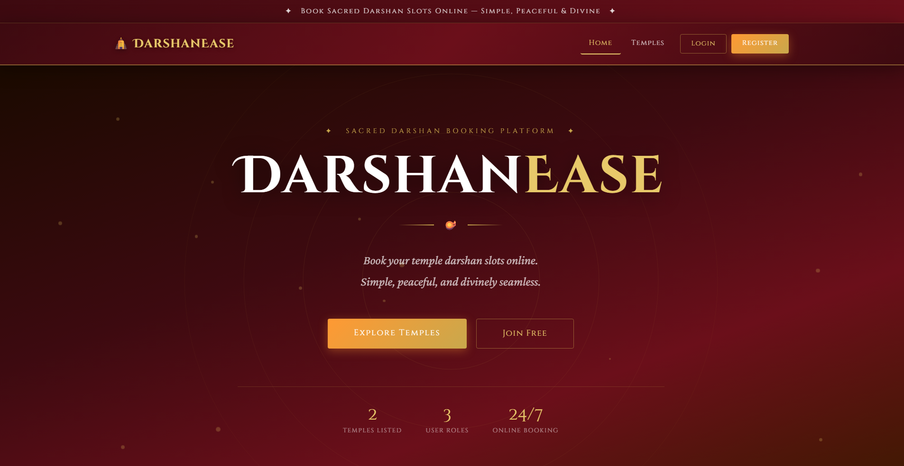
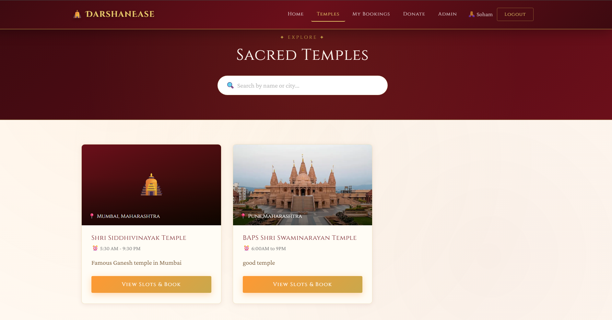
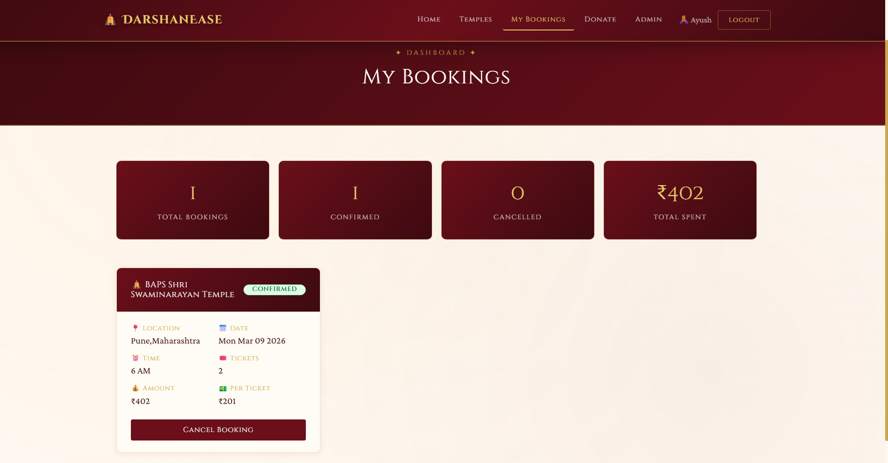
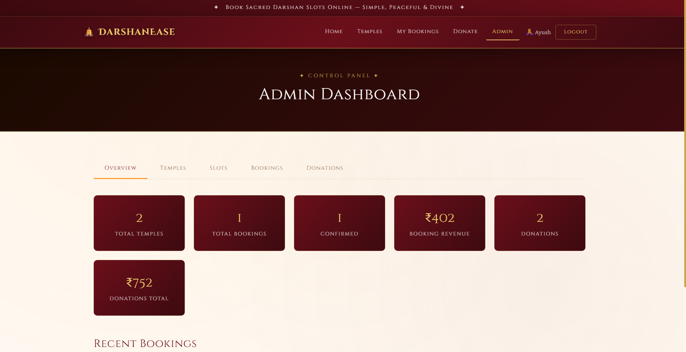

# 🛕 DarshanEase

> **Temple darshan booking platform | MERN Stack | JWT Auth | Role-based access | Admin Dashboard | Cloudinary image uploads**

DarshanEase is a full-stack MERN web application that allows users to explore temples, view available darshan slots, and book tickets online. Built using MongoDB, Express.js, React.js, and Node.js, the project ensures secure authentication, smooth booking management, and real-time slot updates through an interactive interface.

---

## 📸 Screenshots

### Home Page


### Temple Listing


### Temple Detail & Booking


### Admin Dashboard


---

## ✨ Features

- 🔐 **JWT Authentication** — Secure register/login with token-based sessions
- 👥 **Role-Based Access** — Three roles: `USER`, `ADMIN`, `ORGANIZER`
- 🛕 **Temple Management** — Add, view, and delete temples with image uploads
- 🎟️ **Darshan Slot Booking** — Browse available slots, select tickets, and confirm bookings
- ❌ **Booking Cancellation** — Users can cancel confirmed bookings with automatic slot restoration
- 🙏 **Donations** — Make donations to temples with preset or custom amounts
- 📊 **Admin Dashboard** — Full control panel with stats, all bookings, donations, and temple management
- 🖼️ **Cloudinary Image Uploads** — Temple images stored and served via Cloudinary CDN
- 🔍 **Temple Search** — Filter temples by name or location in real time
- 📱 **Responsive UI** — Mobile-friendly design with a rich saffron + gold temple aesthetic

---

## 🧰 Tech Stack

| Layer | Technology |
|---|---|
| Frontend | React.js, React Router DOM, Axios, React Toastify |
| Backend | Node.js, Express.js |
| Database | MongoDB, Mongoose |
| Auth | JWT (jsonwebtoken), bcrypt.js |
| Image Upload | Cloudinary, Multer |
| Styling | Custom CSS (Cinzel + Crimson Pro fonts) |
| Dev Tools | Nodemon, Morgan, Dotenv |

---

## 📁 Project Structure

```
DarshanEase/
├── backend/
│   ├── config/
│   │   ├── db.js               # MongoDB connection
│   │   └── cloudinary.js       # Cloudinary + Multer config
│   ├── controllers/
│   │   ├── authController.js
│   │   ├── templeController.js
│   │   ├── slotController.js
│   │   ├── bookingController.js
│   │   └── donationController.js
│   ├── middleware/
│   │   └── authMiddleware.js   # JWT verify + role guard
│   ├── models/
│   │   ├── User.js
│   │   ├── Temple.js
│   │   ├── DarshanSlot.js
│   │   ├── Booking.js
│   │   └── Donation.js
│   ├── routes/
│   │   ├── authRoutes.js
│   │   ├── templeRoutes.js
│   │   ├── slotRoutes.js
│   │   ├── bookingRoutes.js
│   │   └── donationRoutes.js
│   ├── .env
│   └── server.js
│
└── frontend/
    └── src/
        ├── components/
        │   └── Navbar.js
        ├── context/
        │   └── AuthContext.js
        ├── pages/
        │   ├── Home.js
        │   ├── Login.js
        │   ├── Register.js
        │   ├── Temples.js
        │   ├── TempleDetail.js
        │   ├── MyBookings.js
        │   ├── Donations.js
        │   └── AdminDashboard.js
        ├── services/
        │   └── api.js
        ├── App.js
        └── index.css
```

---

## 🗄️ Database Collections

| Collection | Description |
|---|---|
| `Users` | name, email, passwordHash, role, phone |
| `Temples` | name, location, description, timings, images, createdBy |
| `DarshanSlots` | templeId, date, time, capacity, bookedCount, price, isAvailable |
| `Bookings` | userId, templeId, slotId, ticketCount, totalAmount, status |
| `Donations` | userId, templeId, amount, message, donationDate |

---

## 🔐 API Endpoints

### Auth
```
POST   /api/auth/register       — Register new user
POST   /api/auth/login          — Login and receive JWT
GET    /api/auth/profile        — Get logged-in user profile (protected)
```

### Temples
```
GET    /api/temples             — Get all temples (public)
GET    /api/temples/:id         — Get single temple (public)
POST   /api/temples             — Create temple (ADMIN/ORGANIZER)
PUT    /api/temples/:id         — Update temple (ADMIN/ORGANIZER)
DELETE /api/temples/:id         — Delete temple (ADMIN)
```

### Darshan Slots
```
GET    /api/slots/:templeId     — Get slots for a temple (public)
POST   /api/slots               — Create slot (ADMIN/ORGANIZER)
PUT    /api/slots/:id           — Update slot (ADMIN/ORGANIZER)
DELETE /api/slots/:id           — Delete slot (ADMIN)
```

### Bookings
```
POST   /api/bookings            — Create booking (USER)
GET    /api/bookings/my         — Get my bookings (USER)
GET    /api/bookings/all        — Get all bookings (ADMIN)
PUT    /api/bookings/cancel/:id — Cancel booking (USER/ADMIN)
```

### Donations
```
POST   /api/donations           — Make donation (USER)
GET    /api/donations/my        — Get my donations (USER)
GET    /api/donations/all       — Get all donations (ADMIN)
```

---

## ⚙️ Environment Variables

Create a `.env` file inside the `backend/` folder:

```env
PORT=5000
MONGO_URI=your_mongodb_atlas_connection_string
JWT_SECRET=your_jwt_secret_key
CLOUDINARY_CLOUD_NAME=your_cloudinary_cloud_name
CLOUDINARY_API_KEY=your_cloudinary_api_key
CLOUDINARY_API_SECRET=your_cloudinary_api_secret
```

---

## 🚀 Getting Started

### Prerequisites
- Node.js v16+
- MongoDB Atlas account (free)
- Cloudinary account (free)

### 1. Clone the repository
```bash
git clone https://github.com/YOUR_USERNAME/DarshanEase.git
cd DarshanEase
```

### 2. Setup Backend
```bash
cd backend
npm install
# Create .env file and add your environment variables
npm run dev
```

### 3. Setup Frontend
```bash
cd frontend
npm install
npm start
```

### 4. Open in browser
```
Frontend → http://localhost:3000
Backend  → http://localhost:5000
```

---

## 👤 User Roles

| Role | Permissions |
|---|---|
| `USER` | Browse temples, book slots, cancel bookings, make donations |
| `ORGANIZER` | All USER permissions + create/update temples and slots |
| `ADMIN` | Full access — all of the above + delete temples/slots, view all bookings and donations |

---

## 📦 Dependencies

### Backend
```json
"express", "mongoose", "cors", "bcryptjs",
"jsonwebtoken", "dotenv", "morgan",
"cloudinary", "multer", "multer-storage-cloudinary"
```

### Frontend
```json
"react", "react-router-dom", "axios",
"react-toastify", "react-icons", "bootstrap"
```

---

## 🎯 Key Implementation Highlights

- **JWT Middleware** — Every protected route validates the Bearer token and attaches `req.user`
- **Role Guard** — `authorizeRole(...roles)` middleware restricts routes by role
- **Slot Capacity Logic** — On booking, `bookedCount` increments and slot auto-marks unavailable when full
- **Booking Cancellation** — Cancelling a booking restores slot capacity automatically
- **Axios Interceptor** — Token auto-attached to every API request from frontend
- **React Context** — `AuthContext` manages global user state across all pages
- **Cloudinary Integration** — Images resized to 800×500 on upload via Cloudinary transformations

---

## 🙏 Acknowledgements

- [MongoDB Atlas](https://www.mongodb.com/atlas) — Free cloud database
- [Cloudinary](https://cloudinary.com) — Free image CDN
- [Google Fonts](https://fonts.google.com) — Cinzel & Crimson Pro typefaces

---

<div align="center">
  <strong>Built with 🛕 and ❤️ for DarshanEase</strong>
</div>
